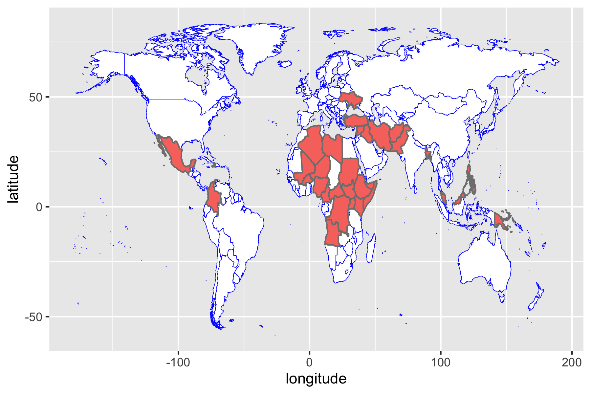
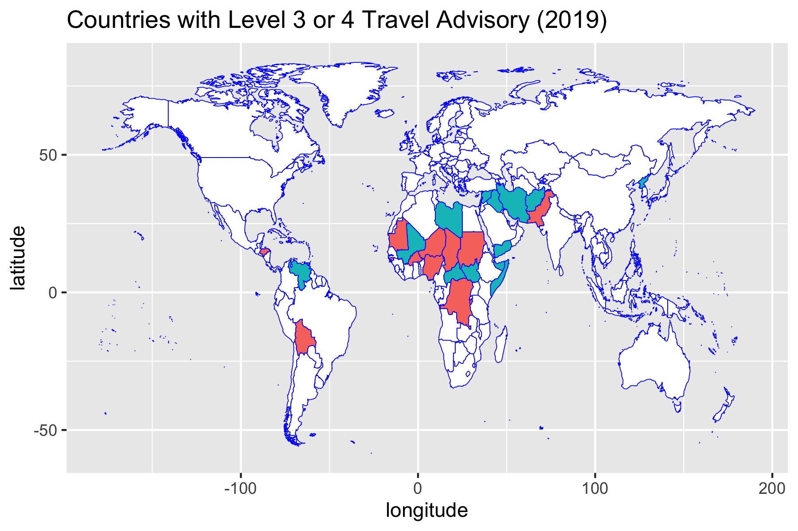

# High-risk for Kidnapping of U.S. Citizens

According to the US State Department and reported on [CNN](https://www.cnn.com/2019/04/10/politics/state-department-travel-advisory-kidnapping-risk/index.html), the following countries have **K** indicator, meaning that Americans are warned of kidnapping.

This code takes the country list and visualizes those countries using the package `ggplot2`. Here is the result of the map:

# Level 4: Do Not Travel (for U.S. Citizens)

According to the US State Department, level 4 is the highest cautionary travel advisory, updated in November 2019, here is a generated map from the [Level 4](https://travel.state.gov/content/travel/en/traveladvisories/traveladvisories.html/) countries:

